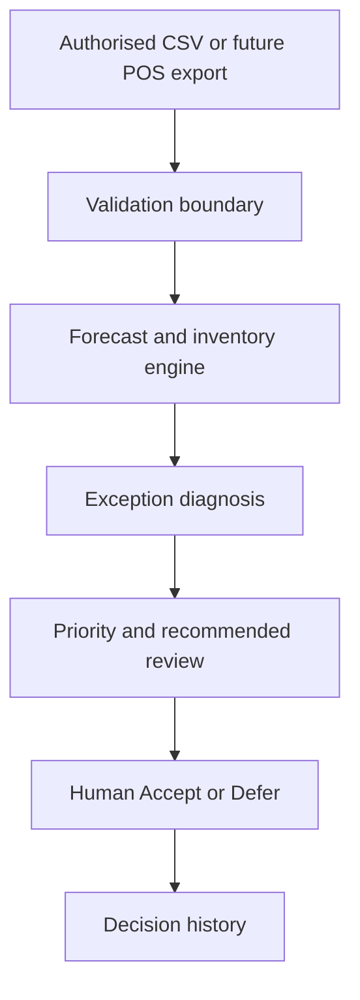

# SupplyLens JAK

Read-only inventory exception and decision-support prototype for Jan Aushadhi Kendra operations.

SupplyLens JAK asks a narrower question than a conventional inventory system:

> Which inventory exceptions deserve attention today, what is probably causing them, and what should a human operator review next?

The project is a portfolio prototype built with synthetic/demo operational data. It is not affiliated with PMBI, does not connect to PMBI systems, and has not been deployed in a Jan Aushadhi Kendra.

## Why this project exists

The initial idea was to build medicine availability and demand forecasting software. Research changed that direction: medicine availability is already exposed through Jan Aushadhi Sugam, while PMBI also performs demand forecasting. Building another availability screen or claiming to invent forecasting would therefore duplicate existing functions.

SupplyLens was reframed as a read-only exception layer for the last-mile operator. Forecasting is used underneath the system, but the visible product is about prioritising and explaining operational exceptions.

### Research grounding

The problem framing was checked against public Government of India material rather than assuming that forecasting or medicine search were missing capabilities:

- [PIB, 13 February 2026](https://www.pib.gov.in/PressReleasePage.aspx?PRID=2227615&lang=1&reg=1) states that PMBI regularly monitors 400 fast-moving products and forecasts their demand on an ongoing basis.
- [PIB, 2019](https://www.pib.gov.in/Pressreleaseshare.aspx?PRID=1583141&lang=2&reg=48) describes the launch of Janaushadhi Sugam with Kendra-location and generic-medicine search functions.
- [PIB, 2026](https://www.pib.gov.in/PressReleasePage.aspx?PRID=2292334&lang=1&reg=48) describes IT-enabled monitoring of medicine availability, stock positions, demand forecasting and replenishment within PMBJP operations.

These sources support the decision not to present SupplyLens as the invention of demand forecasting or the official medicine-availability system.

## What it does

- compares multiple demand forecasting methods using rolling backtests
- calculates safety stock, reorder point, stock position and days of cover
- classifies inventory using ABC/XYZ logic
- flags stockout, excess and near-expiry exposure
- detects demand shifts and replenishment lead-time deterioration
- distinguishes local inventory pressure from an upstream availability constraint
- ranks issues using an exception score
- preserves multiple contributing factors when risks overlap
- labels forecast confidence as High, Medium, Low or Insufficient
- records human Accept/Defer decisions without writing to an operational POS
- invalidates a saved decision when the underlying exception materially changes
- imports validated CSV data and exports an exception worklist
- provides a what-if demand and lead-time stress simulator

## Architecture



The prototype is intentionally read-only relative to any external operational system. A future connector should ingest authorised data; it should not silently write orders or inventory changes back to PMBI/POS.

See [docs/ARCHITECTURE.md](docs/ARCHITECTURE.md) for the calculation and failure-boundary design.

## Run the prototype

No package installation is required.

1. Download this repository.
2. Open `supplylens-jak.html` in a modern browser.
3. Explore the built-in synthetic demo or import a CSV using the documented schema.

The app deliberately remains usable as a local HTML file so it can be demonstrated without a hosted service or paid infrastructure.

## Run the tests

Node.js is required; there are no npm dependencies.

```bash
npm test
```

or run the files directly:

```bash
node supplylens-engine.test.mjs
node supplylens-ui-contract.test.mjs
```

The test suites cover analytical contracts, invalid data, duplicate SKUs, insufficient forecast history, conflicting inventory risks, browser import safety, HTML escaping, CSV formula protection, stale human decisions and differential parity between the browser calculations and analytical engine.

During development, the analytical engine was also exercised against 2,000 randomized valid-item invariant cases and a 5,000-SKU synthetic stress run. Those are engineering stress checks, not evidence of production capacity or field performance.

## CSV schema

Required columns:

```text
sku,name,on_hand,incoming,lead_time_days,expiry_90d,cost,demand_history
```

Optional columns:

```text
reserved,lead_time_sd,baseline_lead_time_days,upstream_available,mandated
```

`demand_history` is a pipe-separated daily series such as `8|9|7|10|8|11`.

See [sample-inventory.csv](sample-inventory.csv).

## Safety and failure boundaries

This version rejects malformed numerical data rather than calculating through it. It also rejects duplicate SKUs, invalid demand values, non-positive lead times, impossible expiry quantities and malformed boolean fields.

Conflicting signals are not collapsed into an unsafe automatic instruction. For example, a SKU that is simultaneously at stockout risk and heavily near-expiry is sent for manual review rather than simply being told to purchase or hold.

See [docs/PILOT_BOUNDARIES.md](docs/PILOT_BOUNDARIES.md) before interpreting this as operational software.

## What is real and what is not

| Item | Status |
|---|---|
| Working browser prototype | Yes |
| Forecast/inventory engine | Yes |
| Automated regression tests | Yes |
| Synthetic/demo dataset | Yes |
| PMBI affiliation | No |
| PMBI API/POS integration | No |
| Real Kendra operational dataset | Not included |
| Kendra field pilot | Not performed |
| Measured stockout reduction | Not claimed |
| Production/commercial readiness | Not claimed |

## What would make it a real pilot

The next useful step is field validation, not more interface features:

1. observe how a Kendra actually reviews and orders inventory;
2. establish what authorised POS/export data is available;
3. map stockout, expiry, incoming-order and upstream-supply states to real fields;
4. calibrate exception thresholds against historical decisions and outcomes;
5. test the tool in read-only parallel use before considering deeper integration;
6. measure whether it improves exception detection or decision time.

## Portfolio context

This project reflects my transition from Industrial & Production Engineering and EdTech teaching into manufacturing, supply-chain and operations analytics. The emphasis is on problem definition, analytical reasoning, explicit assumptions and testable decision support rather than presenting AI-generated software as a substitute for operational knowledge.

## Repository scope

This repository contains only synthetic/demo data and public-safe project material. It contains no confidential company records, patient/customer information, PMBI credentials or proprietary POS data.
